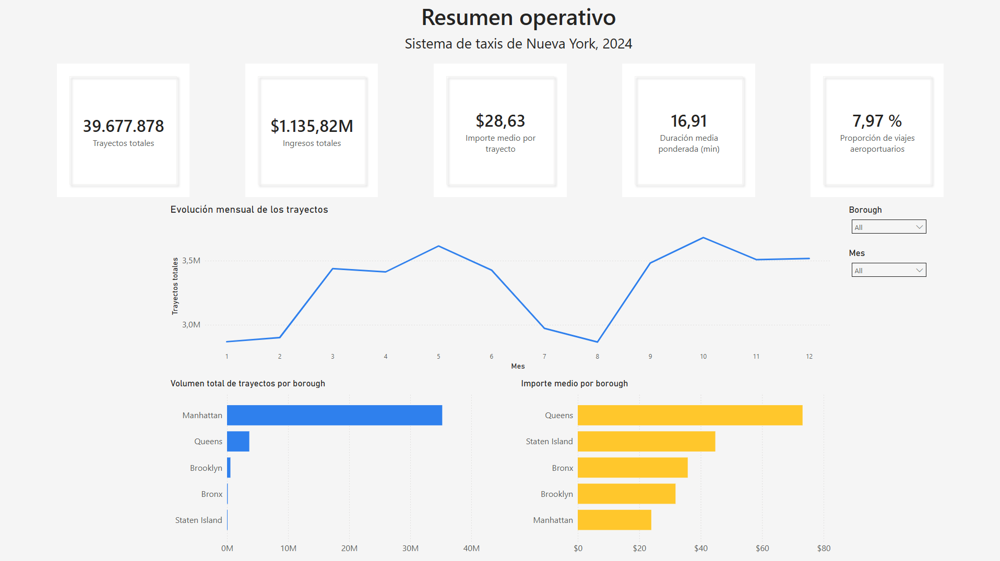
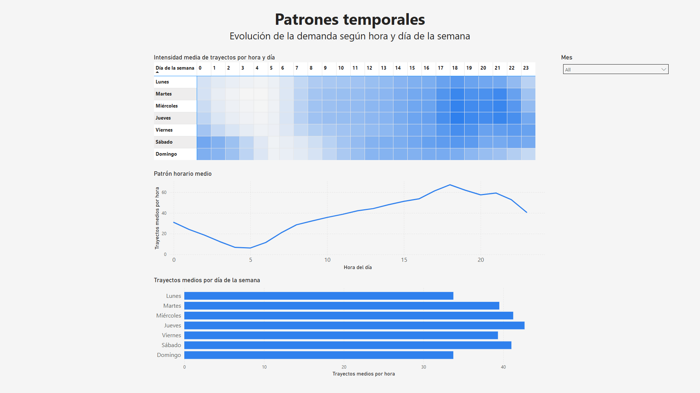
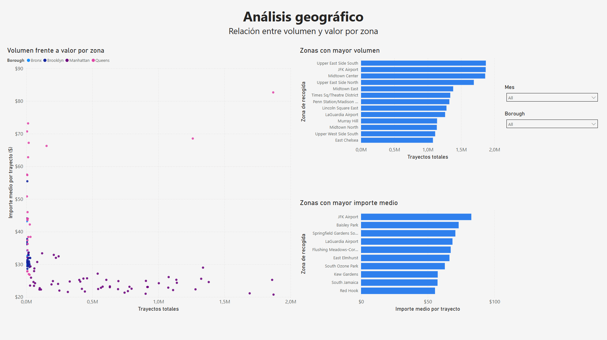
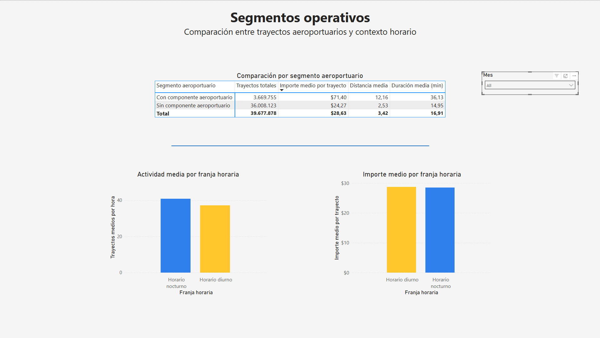

# NYC Taxi Demand & Operational Analysis 2024

Análisis operativo de 40 millones de trayectos de taxi amarillo en Nueva York, combinando datos de la NYC TLC con registros meteorológicos horarios de NOAA y visualizado en Power BI.
El objetivo es estudiar cómo cambian la demanda y el valor económico de los viajes según la hora, la zona de recogida y algunos factores de contexto, como la meteorología y el componente aeroportuario.

## Objetivo del proyecto

El proyecto busca responder a tres preguntas principales:

- ¿En qué momentos del día y de la semana se concentra más actividad?
- ¿Qué zonas combinan mayor volumen operativo y mayor valor medio por trayecto?
- ¿Qué papel tienen los trayectos aeroportuarios y la meteorología dentro del comportamiento general del sistema?

El enfoque no es predictivo, sino descriptivo y analítico. Se prioriza una lectura operativa clara sobre la demanda, el valor económico y la segmentación de zonas.

## Fuentes de datos

Se integraron tres fuentes principales:

1. **NYC TLC Yellow Taxi Trip Records 2024**  
   Datos mensuales de trayectos de taxi amarillo en formato parquet.  
   Fuente: NYC Taxi & Limousine Commission.

2. **NOAA Local Climatological Data 2024**  
   Datos meteorológicos horarios usados para incorporar temperatura, precipitación, visibilidad, viento y contexto de luz/oscuridad.  
   Fuente: NOAA / NCEI.

3. **Taxi Zone Lookup Table**  
   Tabla auxiliar para relacionar `PULocationID` con borough, zona y service zone.  
   Fuente: NYC Taxi & Limousine Commission.

Por tamaño, los ficheros raw de taxi pueden no estar incluidos directamente en el repositorio. El notebook está preparado para trabajar con los archivos descargados dentro de `data/raw/`.

## Herramientas utilizadas

- Python
- pandas
- numpy
- matplotlib
- scipy
- Power BI
- Jupyter Notebook
- VS Code

## Estructura del repositorio

```text
nyc-taxi-analysis-2024/
├── data/
│   ├── raw/
│   │   ├── taxi/
│   │   ├── weather/
│   └── processed/
│       └── taxi_analysis_2024_final.csv
├── dashboard/
│   └── nyc_taxi_dashboard_2024.pbix
├── images/
│   ├── dashboard_resumen.png
│   ├── dashboard_temporal.png
│   ├── dashboard_geografico.png
│   └── dashboard_segmentos.png
├── nyc_taxi_analysis_2024.ipynb
├── README.md
└── requirements.txt
```

El notebook principal se mantiene en la raíz del proyecto para conservar rutas relativas simples hacia `data/raw/` y `data/processed/`.

## Metodología

El flujo de trabajo se organiza en cinco fases:

1. **Carga y validación inicial**  
   Se revisan columnas, tipos de datos, valores nulos y rangos básicos de las variables principales.

2. **Limpieza y preparación**  
   Se filtran registros fuera del año 2024, trayectos con importes o duraciones no válidas y valores extremos poco realistas. También se crean variables temporales como hora, mes, día de la semana y fin de semana.

3. **Agregación operativa**  
   Los datos de taxi se agregan a nivel de hora y zona de recogida. Este nivel permite reducir el volumen de datos y analizar patrones operativos sin perder la dimensión temporal y geográfica.

4. **Integración de fuentes**  
   Se cruzan los datos agregados de taxi con datos meteorológicos horarios y con la tabla auxiliar de zonas.

5. **Análisis y visualización**  
   Se estudian patrones temporales, geográficos, aeroportuarios y meteorológicos. Finalmente, se exporta un dataset procesado para construir un dashboard en Power BI.

## Dashboard

El dashboard de Power BI resume los principales resultados del análisis en cuatro páginas:

### 1. Resumen operativo

Vista general del sistema con indicadores clave:
- trayectos totales
- ingresos totales
- importe medio por trayecto
- duración media
- peso del segmento aeroportuario



### 2. Patrones temporales

Análisis de la actividad media por hora y día de la semana. Incluye una matriz tipo heatmap para detectar franjas de mayor intensidad.



### 3. Análisis geográfico

Comparación entre volumen y valor por zona de recogida. Se muestran zonas de alta actividad, zonas de mayor importe medio y la relación entre ambas dimensiones.



### 4. Segmentos operativos

Comparación entre trayectos con componente aeroportuario y el resto del sistema, además de una lectura básica del comportamiento diurno/nocturno.



## Principales hallazgos

- La demanda no se distribuye de forma uniforme: la hora y la zona de recogida explican gran parte de las diferencias observadas.
- Manhattan concentra la mayor parte del volumen operativo, pero no lidera el importe medio por trayecto.
- Queens destaca en valor medio, principalmente por el peso de los trayectos vinculados a JFK y LaGuardia.
- Los trayectos con componente aeroportuario son el segmento más diferenciado: son más largos, duran más y generan importes medios más altos.
- La lluvia introduce variaciones moderadas, pero no cambia la estructura general del sistema.
- La oscuridad resulta más informativa como variable de contexto: en horario nocturno aumenta la actividad media, aunque el importe medio tiende a bajar ligeramente.

## Limitaciones

- El análisis trabaja con datos agregados por hora y zona de recogida, por lo que se pierde parte del detalle individual de cada trayecto.
- La meteorología se incorpora como contexto operativo, no como explicación causal.
- Algunas zonas aparecen como categorías especiales o sin clasificar dentro de la tabla auxiliar.
- El análisis se centra en la zona de recogida, no en el destino final del trayecto.
- Las conclusiones son descriptivas y comparativas; no deben interpretarse como relaciones causales.

## Cómo reproducir el proyecto

1. Descargar los datos raw de taxi amarillo de 2024 desde NYC TLC.
2. Descargar el archivo meteorológico usado en el proyecto desde NOAA / NCEI.
3. Colocar los archivos en la estructura indicada:

```text
data/raw/taxi/
data/raw/weather/
data/raw/zones/
```

4. Instalar dependencias:

```bash
pip install -r requirements.txt
```

5. Ejecutar el notebook principal:

```text
nyc_taxi_analysis_2024.ipynb
```

6. El notebook genera el dataset procesado:

```text
data/processed/taxi_analysis_2024_final.csv
```

7. Abrir el archivo de Power BI:

```text
dashboard/nyc_taxi_dashboard_2024.pbix
```

## Estado del proyecto

Proyecto finalizado.
