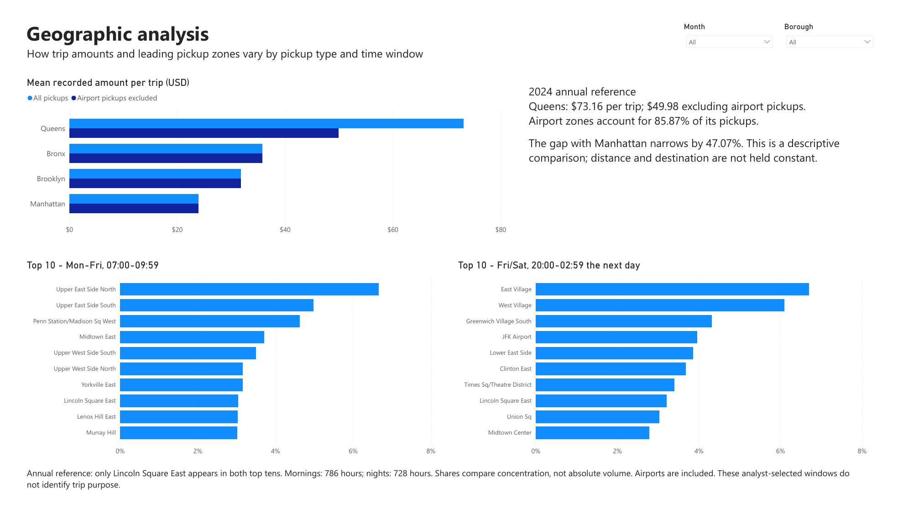

# NYC Taxi - Operational Analysis 2024

**What do annual taxi totals hide about location, timing and trip composition?** This portfolio project uses Python and Power BI to investigate 39.68 million retained NYC yellow taxi trips. It is a descriptive case study for understanding recorded activity and deciding which patterns deserve closer investigation.

**Stack:** Python, pandas, SQL validation with DuckDB, Power Query and DAX. The README, notebook, figures and report definitions use English. Legacy technical measure and column identifiers are retained to preserve model connections; visible report labels are translated.

[View the four-page dashboard PDF](dashboard/NYC%20Taxi%20v2.pdf) · [Open the editable Power BI project](dashboard/NYC%20Taxi%20v2.pbip) · [Read the findings](docs/ANALYTICAL_FINDINGS.md) · [Inspect the notebook](nyc_taxi_analysis_2024.ipynb)



## Three findings

| Question | Result | Why it matters |
|---|---|---|
| Does airport composition affect Queens' higher average trip amount? | Excluding airport pickups lowers Queens' average from **$73.16 to $49.98**, versus Manhattan's **$23.93**. The observed gap narrows **47.07%**. | Borough averages mix different trip populations. Higher recorded amounts alone do not establish profitability. |
| Is October's peak explained by its weekday mix? | October remains first after weekday standardization at **4,926.86 trips per real hour**, just **1.09%** above September. | The ranking survives this adjustment, but the lead is modest. The adjustment does not control for holidays, weather or taxi supply. |
| Do the same pickup zones dominate at different times? | Only **Lincoln Square East** appears in both top-ten lists for weekday mornings and Friday/Saturday nights. | One annual ranking hides different geographic patterns. The windows describe timing; actual trip purpose is unknown. |

The [detailed analysis](docs/ANALYTICAL_FINDINGS.md) defines the comparisons and links each finding to its supporting table and calculation.

## Explore the dashboard

| Page | Focus | Preview |
|---|---|---|
| Overview | Annual KPIs, monthly totals and pickup groups | [View](images/dashboard/01_overview.png) |
| Temporal patterns | Weekday/hour patterns and calendar-adjusted monthly activity | [View](images/dashboard/02_temporal_patterns.png) |
| Geographic analysis | Airport composition and zone rankings by time window | [View](images/dashboard/03_geographic_analysis.png) |
| Operational segments | Airport pickup versus recorded surcharge, with light context | [View](images/dashboard/04_operational_segments.png) |

The editable project is [NYC Taxi v2.pbip](dashboard/NYC%20Taxi%20v2.pbip), with its adjacent report and semantic-model folders. A fresh checkout requires data regeneration and refresh.

**English presentation:** report titles, captions, aliases and category labels are in English. The translated model was refreshed and saved, all 93 DAX checks passed, and all four pages of the September 16 Desktop PDF passed visual review. The previews are unedited renders of that export. See the [language validation record](data/processed/language_validation.json).

## Data and approach

The analysis combines the twelve 2024 NYC TLC yellow taxi files, the taxi-zone lookup and NOAA Central Park weather observations. Source links, cleaning rules and definitions are in the [methodology](docs/METHODOLOGY.md).

| Coverage | Value |
|---|---:|
| Source records | 41,169,720 |
| Retained trips | 39,677,878 |
| Total recorded amount | $1,135,817,146.18 |
| Mean recorded amount per trip | $28.63 |
| Calendar exposure | 8,784 real hours |

The ETL processes one month at a time, records exclusions, and aggregates by pickup hour, zone and positive-surcharge indicator. Additive sums and trip counts support weighted means. A separate hour dimension retains zero-trip hours and the 23/25-hour daylight-saving days. Airport pickup location and recorded airport surcharge remain separate definitions.

## What changed in this update

This update continues the original NYC Taxi portfolio project with the same 2024 sources and four-page report structure. The original annual total of **39,677,878 trips was already correct** and remains unchanged.

- **Corrected hourly activity:** trips are divided by real calendar hours, replacing an average of aggregated fact-row counts. The calendar retains zero-trip hours and handles daylight-saving changes. Trip averages continue to use weighted sums and counts.
- **Clearer segment definitions:** airport pickup location is separate from positive recorded airport surcharge; missing fees are identified. Recorded amounts are labelled without implying profit.
- **Three added comparisons:** airport composition in borough averages, monthly activity under a common weekday mix, and pickup-zone rankings for morning versus weekend-night windows. The findings above show what each comparison adds.
- **Stronger verification:** independent SQL reconciliation, focused Python tests, and 12 baseline plus 81 analytical DAX checks support the calculations. All four pages of the English Desktop PDF passed visual review. Overview slicer filtering and reset were also checked; other chart interactions were not manually tested.
- **Easier review and reproduction:** editable PBIP definitions, the reviewed English PDF, dashboard previews, Python figures, source checksums and setup instructions accompany the code. Old working copies and internal handoff notes are excluded from the publication package.

The scope remains descriptive. This update does not add a predictive model, establish causal effects or demonstrate business savings.

## Validation

| Evidence | Result |
|---|---|
| [Independent SQL over raw files](data/processed/independent_validation.json) | Matches the ETL's 39,677,878 retained trips and reviewed aggregate amounts within tolerance |
| [Python tests](tests/) and [executed notebook](data/processed/notebook_validation.json) | All six Python tests and all 11 translated notebook code cells passed on September 16 |
| [Additional comparison checks](data/processed/analysis_questions/validation.json) | 28 city-hour reconciliations and three chart reviews passed |
| [Refreshed English Power BI model](data/processed/powerbi_analytical_validation.json) | All 12 baseline scenarios and 81 analytical DAX checks passed on September 16 after refreshing the translated hour dimension |
| [English report definitions](data/processed/powerbi_report_file_validation.json) | 80 direct field references checked |
| [English Desktop PDF](data/processed/powerbi_analytical_visual_review.json) | All four pages passed visual review; charts populated, labels legible and no missing-data warnings |

**Interaction coverage:** [Overview filter and reset checks](data/processed/powerbi_interaction_validation.json) confirm Queens plus August gives 314,917 trips (screenshot reviewed), and clearing restores 39,677,878 (owner confirmed). Chart selections and geographic-page interactions were not manually tested. The [Power BI guide](powerbi/IMPLEMENTATION.md) includes the repeatable checks.

## Reproduce locally

Use Python 3.12 and run commands from the project root. Create a virtual environment:

```bash
python -m venv .venv
```

Activate it with `.venv\Scripts\Activate.ps1` in PowerShell or `source .venv/bin/activate` in Bash, then:

```bash
python -m pip install -r requirements.txt
python scripts/download_data.py
python src/etl.py
python scripts/analyze_operational_questions.py
python -m unittest discover -s tests -v
```

The downloader uses a pinned source snapshot and checks SHA-256 hashes. It downloads all twelve monthly trip files; allow disk space for those sources and the regenerated outputs. Weather, zones, compact aggregates and recorded validation results are included. Raw trip files, the large fact CSV/Parquet and Power BI caches are excluded from Git.

To rerun the notebook without a separate kernel process:

```bash
python scripts/run_notebook.py
```

Alternatively, open `nyc_taxi_analysis_2024.ipynb` in Jupyter or VS Code. The recorded execution used an in-process kernel because the original execution environment blocked normal Jupyter startup.

For the independent raw-source SQL check:

```bash
python -m pip install duckdb==1.5.5
python scripts/validate_independent.py
```

For Power BI, open the PBIP, set the **ProjectRoot** Power Query parameter to your checkout's absolute root path, and refresh after running the ETL. Follow the [Power BI setup and checks](powerbi/IMPLEMENTATION.md). The publication copy uses `C:/path/to/nyc-taxi-operational-analysis` as a placeholder.

## Limitations

These are completed yellow taxi trips, not unmet demand or all NYC mobility. Vehicle availability and operating costs are absent, so the analysis cannot recommend profitable driver allocation. Recorded amounts are not profit; cash tips are unrecorded and airport fees can be missing. Weather is descriptive context from one station. One year of observational data does not establish causality or a recurring seasonal rule.
