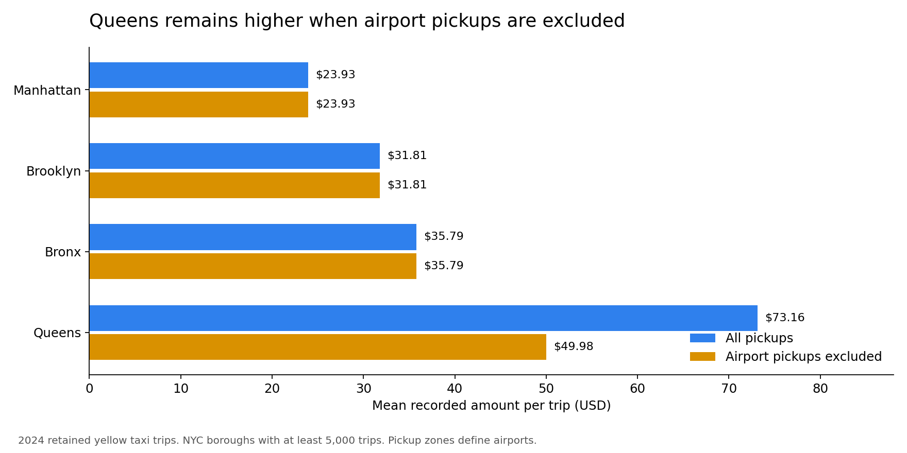
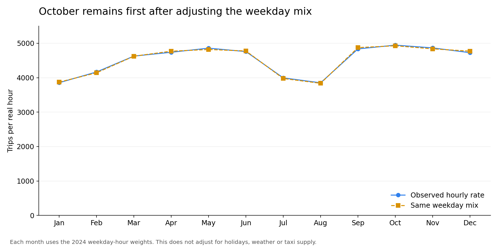
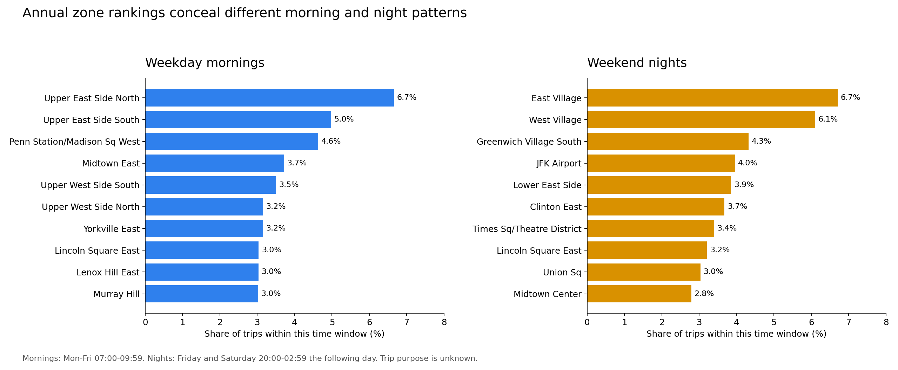

# What the annual totals hide

These three comparisons use the same 39,677,878 retained yellow taxi trips from 2024. They extend the descriptive analysis without changing the source data, fitting a predictive model or claiming a causal effect. The charts below are Python outputs. Equivalent native Power BI visuals and six DAX measures were added on September 14; 81 analytical DAX checks passed after reopening the PBIP. The translated model was refreshed and saved on September 16, all 93 DAX checks passed again, and all four pages of the English Desktop PDF passed visual review. Overview slicer filtering and reset are confirmed; chart selections and geographic-page interactions were not manually tested. See [Power BI setup and validation](../powerbi/IMPLEMENTATION.md).

## 1. Airport mix only partly accounts for Queens' higher average amount

Queens records a mean amount of **$73.16 per trip**, compared with **$23.93 in Manhattan**. However, **85.87% of Queens trips start in an airport pickup zone**. Comparing those borough-wide means alone mixes different types of trips.

Excluding airport pickups lowers the Queens average to **$49.98 across 515,018 trips**. Its difference from Manhattan narrows from **$49.23 to $26.06**, a **47.07% reduction** in the observed gap. Queens still has the highest non-airport average among the NYC boroughs with at least 5,000 retained trips.



**Interpretation:** airport composition materially affects the borough comparison, but it is not the whole explanation. Further investigation could examine trip distance and fare composition within non-airport pickups. Higher recorded amounts alone do not establish profitability or a better location for a driver.

**Calculation:** divide each subset's total recorded amount by its trip count. Airport pickup is defined by pickup zones 1, 132 and 138, separately from the recorded airport surcharge. The chart includes NYC boroughs with at least 5,000 trips; Staten Island has only 1,462. Newark and Unknown remain in the exported supporting table.

**Limit:** removing a subset changes the population being compared. The 47.07% reduction is a descriptive comparison, not a causal attribution or a like-for-like estimate holding distance, destination and time constant. An airport destination can still appear among non-airport pickups.

Supporting data: [borough comparison](../data/processed/analysis_questions/borough_airport_mix.csv).

## 2. October stays first with the same weekday mix

October's observed activity is **4,945.66 trips per real hour**. Giving each month the same weekday composition changes October to **4,926.86**, which remains the highest value. September is second at **4,873.52**. October's lead over September is only **1.09%** after the adjustment.



**Interpretation:** October's first-place ranking survives this calendar adjustment. Its advantage over September is modest, so the more useful finding is the broad contrast between the summer low and the stronger autumn period, rather than treating October as an isolated exceptional month.

**Calculation:**

1. For every month and weekday, divide trips by the real hours belonging to that weekday in the month.
2. Calculate each weekday's share of all 8,784 real hours in 2024.
3. Weight each month's seven weekday rates by those same annual shares and add them together.

This asks what the observed monthly rate would look like under one common weekday mix. Real-hour denominators retain daylight-saving exposure and zero-trip hours. It is a simple standardization of observed rates, not a forecast.

**Limit:** the adjustment covers weekday composition. It does not isolate effects of holidays, weather, tourism, taxi supply or other changes between months. One year's pattern does not establish a recurring seasonal rule.

Supporting data: [monthly results](../data/processed/analysis_questions/monthly_calendar_comparison.csv) and [weekday rates and reference weights](../data/processed/analysis_questions/monthly_weekday_rates.csv).

## 3. Morning and weekend-night activity concentrates in different zones

Only **one zone, Lincoln Square East, appears in both top-ten lists**.

| Defined window | Total trips | Real hours | Leading pickup zone | Share within window |
|---|---:|---:|---|---:|
| Monday-Friday, 07:00-09:59 | 3,578,390 | 786 | Upper East Side North | 6.66% |
| Friday and Saturday, 20:00-02:59 the following day | 4,107,220 | 728 | East Village | 6.70% |

Upper East Side North and South lead the morning list. East Village and West Village lead the weekend-night list. These are different geographic patterns that one annual zone ranking cannot communicate.



**Interpretation:** an operational review should segment geography by time window before deciding which areas deserve closer investigation. This comparison identifies where completed-trip activity was concentrated in two clearly defined periods. It does not demonstrate unmet demand, available vehicles or the benefits of relocating drivers.

**Calculation:** sum trips by pickup zone in each window and divide by all trips within the same window. The table also includes trips per real hour, using a single calendar denominator for every zone in that window. Weekend nights include Saturday and Sunday 00:00-02:59; Friday early morning is excluded. All airport pickups remain included.

**Limit:** the windows are analyst-selected examples. The data does not identify commuting or leisure purposes, and different time boundaries may change rankings. Holidays are retained. Shares describe concentration within a window rather than equal absolute volume across windows.

Supporting data: [all zone rankings and denominators](../data/processed/analysis_questions/zone_time_windows.csv).

## Reproduce and inspect

From the project root, after installing the existing requirements:

```bash
python scripts/analyze_operational_questions.py
python -m unittest discover -s tests -p "test_operational_questions.py" -v
```

The script reads the reviewed fact CSV and hour dimension, verifies their headline totals, and writes the tables, three charts and [summary with input hashes](../data/processed/analysis_questions/findings.json). It does not edit its inputs or refresh Power BI.

Three tests cover a hand-calculated weighted airport comparison, a synthetic example where weekday composition alone explains a difference, and the overnight window boundaries. These passed locally on 2026-09-11. A separate calculation from the existing city-hour dataset also reconciled all twelve monthly trip totals and hour denominators, plus both time-window totals and denominators: 28 checks passed. The three generated charts were visually inspected. The [September 11 validation record](../data/processed/analysis_questions/validation.json) predates Power BI integration; its integration field describes that earlier stage. Current model results are in the [September 16 DAX record](../data/processed/powerbi_analytical_validation.json).

Source and cleaning definitions: [methodology](METHODOLOGY.md). The twelve baseline Desktop scenarios and 81 analytical checks passed again after refreshing the translated model on September 16. A separate review checked all four English PDF pages. These checks do not establish clicked behavior in Desktop.
